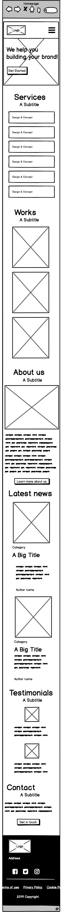

# 0x03. Responsive design

`HTML` `CSS` `Front-end` `Responsive design`
|By: David Dias, Senior Software Engineer at HomeX|
|:--|
|Weight: 1|
|Project will start Jan 18, 2023 6:00 AM, must end by Jan 20, 2023 6:00 AM|
|Manual QA review must be done (request it when you are done with the project)|

## Concepts

_For this project, we expect you to look at this concept:_

- [Responsive web design](https://intranet.alxswe.com/concepts/546)

## Resources

**Read or watch:**

- [The building blocks of responsive design - Progressive web apps | MDN](https://developer.mozilla.org/en-US/docs/Web/Progressive_web_apps/Responsive/responsive_design_building_blocks)
- [A pragmatic guide to designing and building responsive web applications | developerlife.com](https://developerlife.com/2019/08/25/guide-to-building-responsive-web-apps/)
- [Understanding the difference between mobile-first, adaptive and responsive design](https://fredericgonzalo.com/en/understanding-the-difference-between-mobile-first-adaptive-and-responsive-design/)
- [LukeW | Mobile First](https://www.lukew.com/ff/entry.asp?933)
- [Media Queries | A collection of inspirational websites using media queries and responsive web design](https://mediaqueri.es/)
- [Responsive Design Newsletter](https://bytes.dev/?s=rwd)
- [Responsive breakpoint](https://www.responsivebreakpoints.com/)

## Learning Objectives

At the end of this project, you are expected to be able to explain to anyone, without the help of Google:

- Mobile-first design
- Media-queries
- Sizes to use for responsive web design
- How to make a website responsive
- The differences between responsive and adaptive design
- CSS units that are used to make elements flexible

## Requirements

- Allowed editors: vi, vim, emacs
- A README.md at the root of the project directory is mandatory
- HTML and CSS have been rendered on Chrome 78 or more.

## Wireframe of the Techium project - mobile version

@codewithmide
